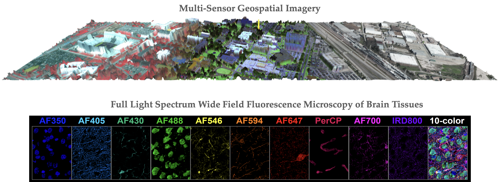

The research focus of our lab is advancing the state-of-the-art in machine learning and image processing for challenging applications such as geospatial imaging and biomedical data analysis. Our current research focus entails development of machine learning and image processing techniques for robust analysis of multi-sensor, high dimensional data.

