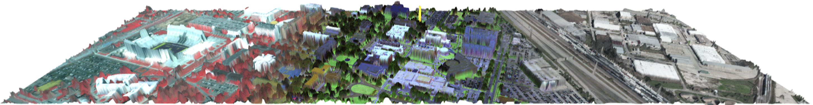
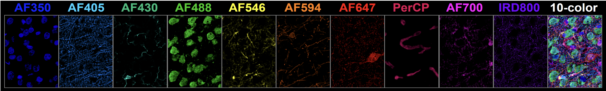

The research focus of our lab is advancing machine learning and image processing for challenging applications such as [geospatial imaging](##Multi-Scale,-Multi-Sensor-GeoAI) and [biomedicine](##AI-in-BioMedicine). Our current research focus entails development of machine learning and image processing techniques for robust analysis of multi-sensor, multi-scale, high dimensional data. Our lab is supported in part by the following sponsors: NASA, NSF, NIH, DoD and Amazon AWS. 

## Multi-Scale, Multi-Sensor GeoAI

Multi-Sensor, Multi-Scale Geospatial Image Analysis is a key application focus of our lab. Modern geospatial imaging via both active and passive sensing modalities (e.g. Multispectral, Hyperspectral, LiDAR and SAR) aboard platforms such as satellites as well as manned and unmanned aircraft are a double-edge-sword. On the one hand they can facilitate a remarkable understanding of the earth. On the other hand, the high dimensionality of modern multi-channel imagers, along with the limited ground truth available for remote sensing tasks make effective image analysis fraught with challenges that must be addressed.  

See the following page for details on our ongoing NASA GeoAI project.
[NASA GeoAI Github](https://github.com/PrasadLab/NASA-GeoAI-Project){:target="_blank" rel="noopener"}

## AI in Biomedicine 

Modern biomedical imaging systems (e.g. FTIR Microscopy and highly-multiplexed immuno-flourescence microscopy) can capture very high resolution imagery and provide rich multi-channel characterization of the underlying biological processes. As an example, by leveraging a multitude of biomarkers when acquiring IF images, highly multiplexed IF microscopy has the potential to provide a rich multi-channel representation of the tissue for accurate identification of all relevant cell phenotypes, which constitute the tissue and exhibit specific cell patterning distributions that define unique anatomical regions that make up an organ structure (e.g. within the rat brain). To effectively utilize emerging machine learning paradigm on these data, one needs to address the unique nuances and challenges posed by such imagery. 

### Highly Multiplex Brain Tissue Imaging

