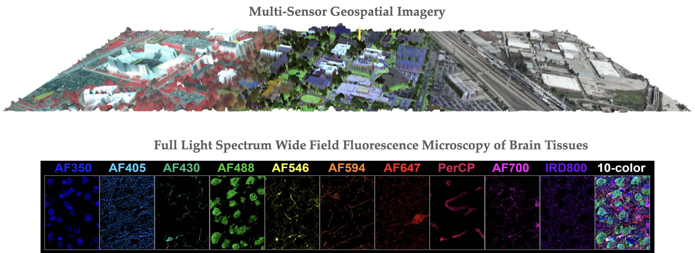

The research focus of our lab is advancing machine learning and image processing for challenging applications such as geospatial imaging and biomedical data analysis. Our current research focus entails development of machine learning and image processing techniques for robust analysis of multi-sensor, multi-scale, high dimensional data. We acknowledge the following sponsors for supporting the research in our lab: NASA, NSF, NIH, DoD and Amazon AWS. 

## Multi-Scale, Multi-Sensor GeoAI

## AI for Highly Multiplex Brain Tissue Imaging

